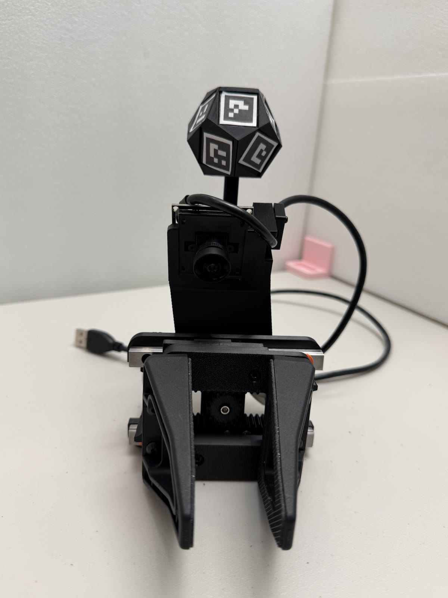
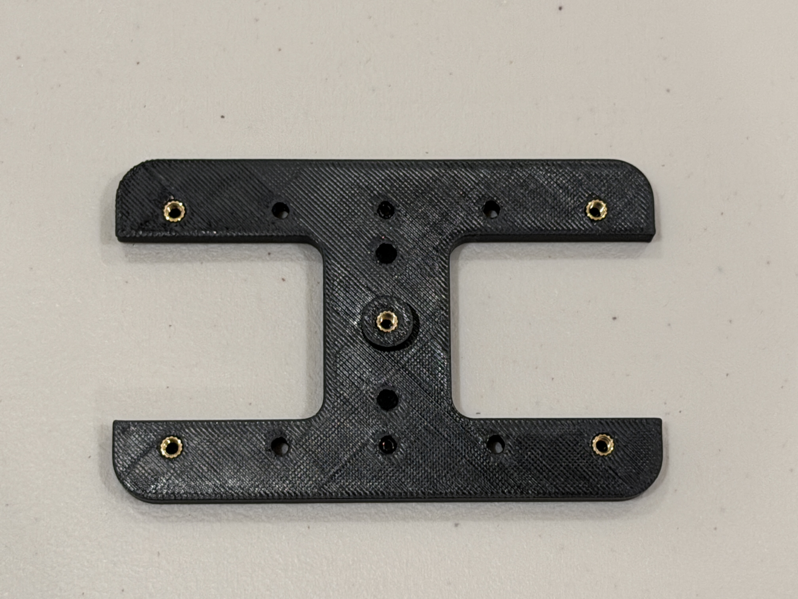
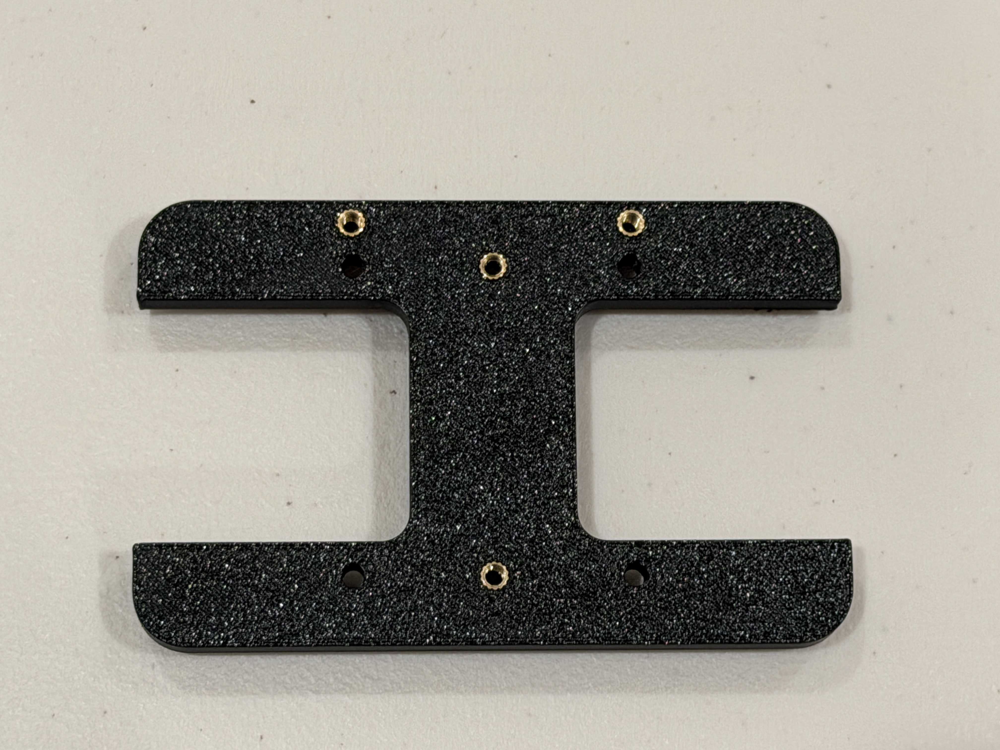
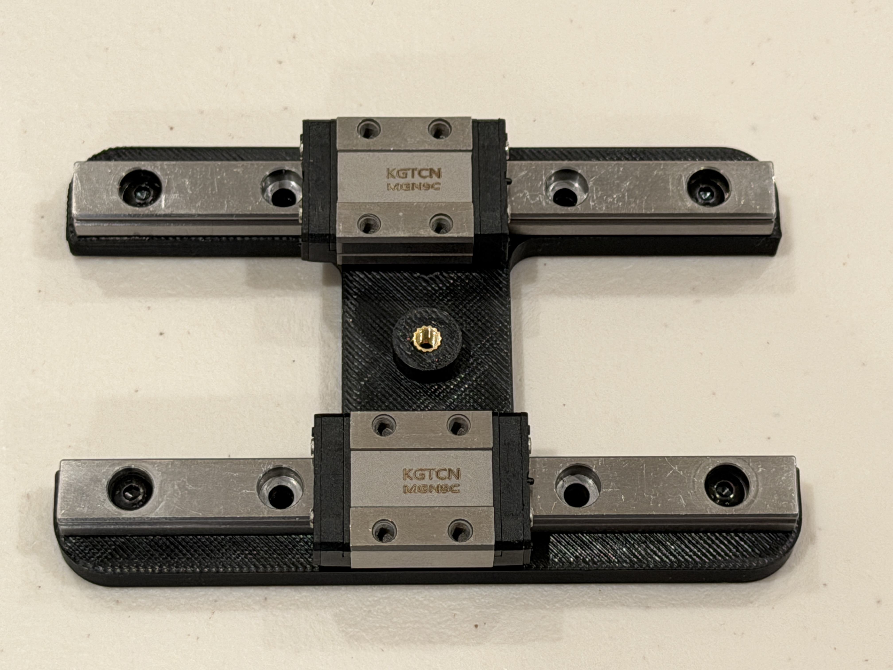
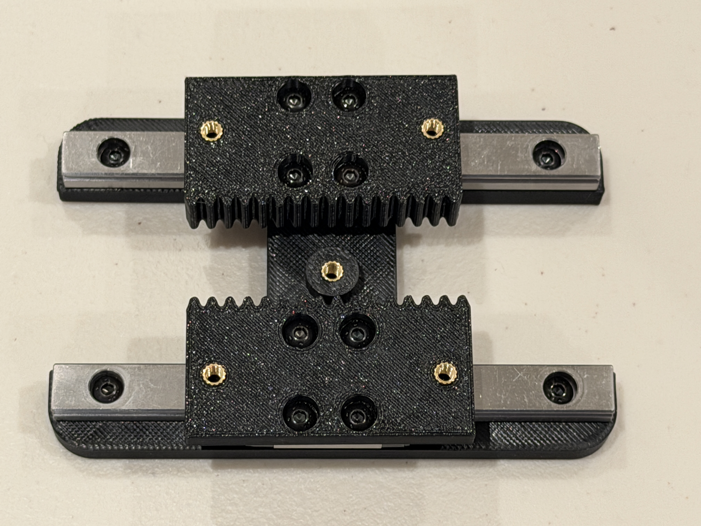
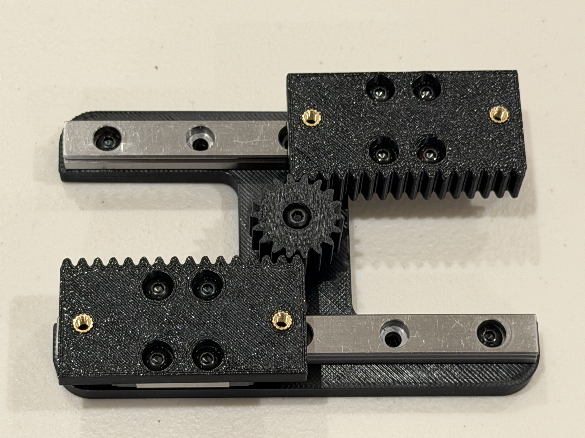
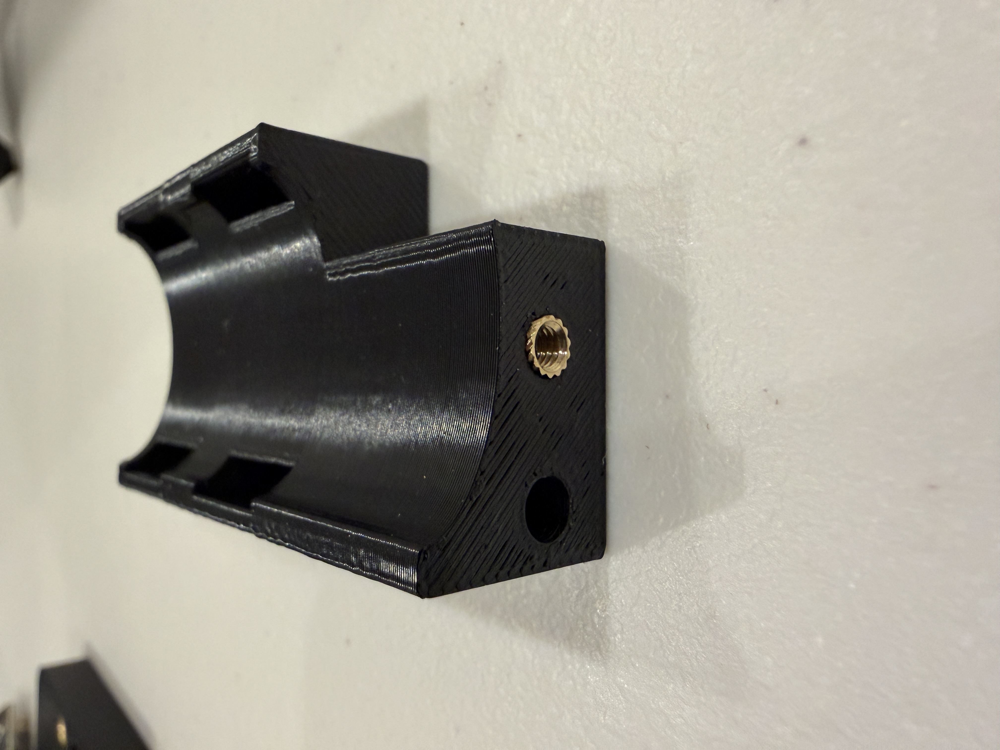
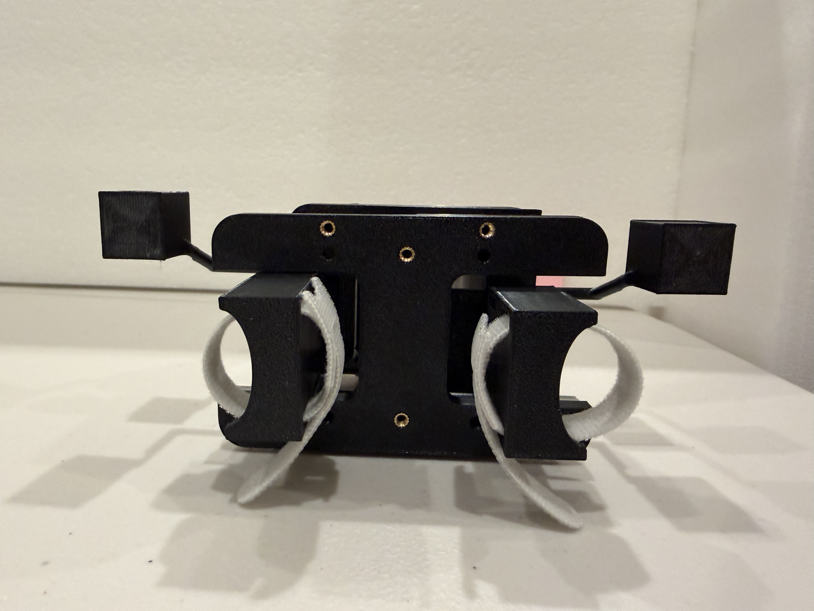
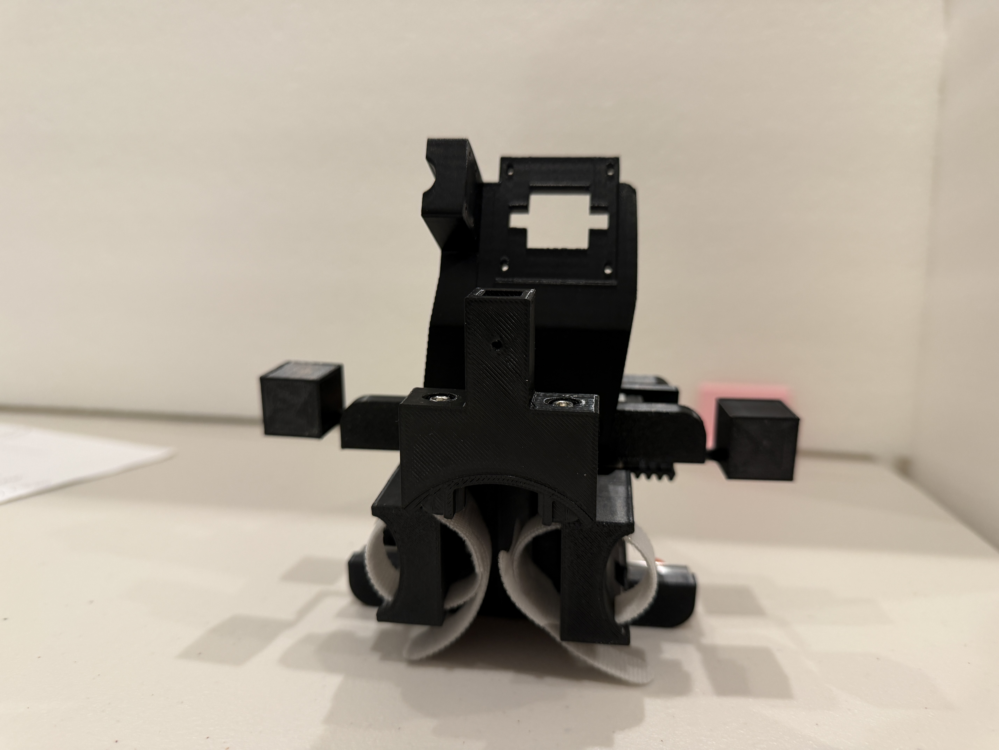

# YAM-UMI Assembly Guide

YAM-UMI is a hand-worn, two-finger gripper. Your fingers open and close the handles, while two racks remain coupled through a central pinion; the wrist camera moves with the gripper and records the grasping area.

The assembly sequence is: **Prepare the parts → Base plate and rails → Racks and pinion → Gripper fingers and handles → Straps → Wrist camera → Optional marker-ball assembly → Markers and camera calibration → Final checks.** After installing each set of moving parts, check that opening and closing remain smooth before continuing.

The photo below shows the gripper with its wrist camera and optional marker ball. The marker ball lets a fixed external camera track the gripper's position and orientation. Install it only if you choose external-camera tracking; Section 6 describes this option and the alternatives.

## 0. Before You Start

### Identify the Main Parts

| Name | Shape and function | File or source | Quantity per assembly |
|---|---|---|---:|
| Base plate | H-shaped plate supporting the rails and central pinion | `plate_v6` | 1 |
| Rack adapter | Rectangular block with teeth along one edge, connecting the carriage to the gripper-finger assembly | `adapter_v10` | 2 |
| Central pinion | Meshes with both racks to couple their motion | `pinion_z18_deep_v0` through `v3`; install one variant | 1 |
| L bracket | Connects the gripper finger, handle, and rack adapter | `L_bracket_v4` | 2 |
| Finger handle | Curved finger cradle with a strap opening | `handle_v14` | 2 |
| Gripper finger | Contacts the object directly, with a rubber gripping surface on the inside | Stock YAM "Linear 4310" gripper fingers | 2 |
| Rails and carriages | Constrain the gripper fingers to linear motion | MGN9 100 mm rails and MGN9C carriages | 2 each |
| Camera mount and cover | Secure the wrist fisheye camera | `YAM_linear_gripper_fisheye_camera_mount_main` and `_cover` | 1 each |
| Wrist camera | Records the grasping area and the markers on the gripper fingers | Arducam fisheye USB camera compatible with the mount | 1 |
| Hook-and-loop straps | Secure your fingers to the handles | Straps approximately 6 inches long | 2 |

Print files are in the [gripper STL directory](../hardware/STL/). The four pinion sizes are for test fitting; install only the one that turns most smoothly. Use stock YAM gripper fingers, which do not need to be printed. Parts for the optional marker-ball assembly are listed in Section 6.

Some photos show thin rods extending to either side of the gripper, ending in square platforms. These are marker extensions for the external-camera setup and are not required for the basic YAM-UMI assembly; the photos illustrate the shared gripper structure.

### Tools and Supplies

Prepare hex tools that fit the screws, a soldering iron with a heat-set insert tip, calipers, small scissors, M3/M4 screws, heat-set inserts, thin double-sided tape, and matte paper or label stock for the markers. PETG can be used for the printed parts; remove supports and burrs, paying particular attention to the tooth gaps, mounting holes, and mating surfaces.

`M3 × 12 mm` means a screw with a nominal thread diameter of 3 mm and a length of 12 mm; the non-countersunk screws used in this guide are measured from beneath the head to the tip. **M3 and M4 are not interchangeable.** Start each screw by hand for a few turns to check that the threads engage smoothly before using a tool.

**All M3 screws in this assembly are button-head screws with a low-profile dome.** Taller socket-cap or pan heads can collide with neighbouring parts; do not substitute head styles even when the thread and length match.

Where a screw length is not specified, choose a screw of the correct thread size that fully engages its insert or nut and brings the two parts together. For the M4 gripper-finger screws, also satisfy the handle engagement and rack clearance requirements in Section 3. If a screw stops turning while a gap remains between the parts, its tip may have reached the bottom of the hole; do not force it. Use a shorter screw and check the hole alignment. Do not choose screw lengths solely from the amount of exposed thread in a photo.

### Install Heat-Set Inserts First

Heat-set inserts are internally threaded brass fittings embedded in printed parts, allowing screws to be installed repeatedly. Install them before assembling the parts, while the holes are easy to reach.

1. Lay the printed part flat and identify the insert seats. Plain through-holes are only for screws to pass through; do not press inserts into every hole.
2. Choose inserts that fit the seats. Use M3 inserts that are 5 mm long with a 4 mm outside diameter; the outside diameter and length of the M4 inserts must match the seats in the L brackets.
3. Heat the insert with the installation tip and slowly press it along the hole axis, keeping it perpendicular. Position it against the seat in the printed part so that protruding brass does not prevent adjacent parts from mating.
4. Let the plastic cool before test fitting a screw. If an insert is tilted, loose, or turns with the screw, repair the connection before continuing.

The soldering iron and freshly installed inserts are very hot; do not touch them with your hands.

## 1. Base Plate and Rails

The two parallel rails each carry a carriage for one gripper finger. First confirm the base plate's orientation, then secure the rails and check that the carriages move smoothly.

### Required Parts

| Part | Quantity |
|---|---:|
| Base plate | 1 |
| MGN9 100 mm linear rail | 2 |
| MGN9C carriage | 2, one per rail |
| Mounting screws compatible with the rail holes and base-plate inserts | 4, two per rail |

### Orient the Base Plate

Install the base plate's heat-set inserts before mounting the rails. Align the inserts with their holes so that tilted or protruding inserts do not prevent the parts from mating.

The photo below shows the rail-mounting face of the base plate. Five inserts are visible: one at each corner and one in the center. Keep this face upward when installing the rails.

The opposite face has four visible M3 inserts. In the orientation shown below, the two on the right secure the camera mount. The two in the center secure the optional marker-ball support assembly, which carries the [`wrist_stalk_arc_adapter` rod mount](../pos-tracking/wrist_dodecahedron_marker/wrist_stalk_arc_adapter.stl); see Section 6 for the bracket connections.

### Secure the Rails

1. Place the two rails in their mounting positions on either side of the base plate, parallel to each other, with the carriage mounting faces upward.
2. Align the rail holes with the mounting holes in the base plate. Use two screws per rail, positioned as shown below. Start the screws, then tighten them gradually until the rails sit flush against the plate.
3. Keep the rail end stops in place during assembly to prevent a carriage from sliding off the rail and shedding its ball bearings.

### Check Sliding Motion

Gently push each carriage and check that it moves smoothly throughout the usable rail travel. The rails must be secure, with no looseness between the rails and base plate. If a carriage binds, check that the rail sits flat and the mounting screws are properly seated before installing the rack adapters.

## 2. Rack Adapters and Central Pinion

Each adapter is secured to a carriage and carries one rack. The central pinion meshes with both racks, making the adapters move together in opposite directions.

### Required Parts

| Part | Quantity |
|---|---:|
| Rack adapter | 2 |
| M3 heat-set inserts for the adapters | 4, two per adapter |
| M3 × 6 mm screws for the adapter-to-carriage connections | 8, four per adapter |
| Central pinion | 1 |
| MR63ZZ bearings, 3 mm bore, 6 mm outside diameter, 2.5 mm thick | 2 |
| M3 × 16 mm screw serving as the pinion axle | 1 |

### Install the Rack Adapters

The four central mounting holes in each adapter attach it to the carriage. The heat-set inserts on either side are used later to attach the gripper-finger assembly. Install these inserts before securing the adapter to the carriage.

1. Place one adapter on each carriage, with the toothed edges facing each other toward the center of the base plate.
2. Align the four adapter holes with the threaded holes in the carriage and secure each adapter with four M3 × 6 mm screws.
3. Move each adapter independently to check that it still slides smoothly along its rail and does not interfere with the base plate or rail ends.

### Install the Central Pinion

The pinion comes in four fit variants, `pinion_z18_deep_v0` through `v3`. Test fit them and choose the one that meshes smoothly with both racks without binding.

1. Insert the two bearings one after the other into the pinion's deeper central seat, stacking them coaxially to a total thickness of 5 mm. The shallow counterbore on the opposite face accommodates the screw head; do not reverse the two faces.
2. Place the pinion between the racks with its bearing-seat face toward the base plate. Gently move the adapters and rotate the pinion until both racks mesh with it; do not force it into place while tooth tips are pressing against each other.
3. Insert the M3 × 16 mm screw from above the pinion, pass it through the bearings, and thread it into the central insert in the base plate. Keep the axle screw perpendicular to the plate so the pinion does not tilt.
4. Turn the axle screw in gradually until the pinion is stably located but can still rotate freely. Do not tighten it so far that the screw head presses against the pinion and restricts rotation.

### Check Coupled Motion

Gently push either adapter; the other should move with it in the opposite direction through the central pinion. Move them back and forth within the rail stops, checking that the pinion turns steadily, both racks remain engaged, and there is no binding or tooth skipping.

If resistance increases noticeably after installing the pinion, first check whether the axle screw is clamping the pinion, the pinion is tilted, or the pinion-to-rack fit is too tight. Confirm that the transmission moves smoothly before installing the gripper-finger assemblies.

## 3. Gripper Fingers and Finger Handles

First combine each gripper finger with an L bracket and handle to form a subassembly, then attach it to a rack adapter. The gripper fingers face the object, and the handles sit on the operator's side; the rubber gripping surfaces face each other.

### Required Parts

| Part | Total for both sides |
|---|---:|
| YAM "Linear 4310" gripper fingers | 2 |
| L brackets `L_bracket_v4` | 2 |
| Handles `handle_v14` | 2 |
| M3 heat-set inserts for the handles | 2, one per handle |
| M4 heat-set inserts for the L brackets | 4, two per bracket |
| M3 × 12 mm screws | 6, one per side to secure the handle and two per side to attach the rack adapter |
| M4 gripper-finger mounting screws | 4: one longer screw and one shorter screw per side, sized for the engagement and clearance described below |
| Washers or M4 nuts to use as spacers under the shorter screw heads | As needed to prevent the screws from protruding below the L brackets |

### Attach the Handles to the L Brackets

Each handle has a curved finger cradle, a strap opening, and mounting holes in its end face. First install an M3 insert in its seat, leaving the other hole clear for the anti-rotation fit.

1. Install M4 inserts in the two seats on the short leg of the L bracket.
2. Place the end face of the handle against the back of the bracket's short leg. Align the central M3 mounting hole and the anti-rotation hole.
3. Insert an M3 × 12 mm screw from the L-bracket side and thread it into the handle's M3 insert. Once secured, the parts should sit flush with no looseness.

`handle_v14` is secured with an M3 screw and does not require an additional M4 nut on its side.

### Secure the Gripper Fingers

1. Place the gripper finger's mounting face against the short leg of the L bracket, aligning the two mounting holes with the M4 inserts.
2. Insert two M4 screws from the gripper-finger side, using different lengths at the two holes:
   - The hole over the handle takes the **longer screw**. It passes through the finger and L bracket and extends partway into the handle to prevent rotation. Choose a length that engages the handle without bottoming out.
   - The other hole takes the **shorter screw**. It must engage the L bracket's insert without protruding below the bracket, where it would collide with the opposite rack. If the shortest available screw still protrudes, place a washer or an M4 nut under its head to take up the excess length while preserving thread engagement.
3. Start both screws in their threads, then tighten them gradually, alternating between them, until the gripper finger sits flush against the bracket. Do not use screw-tightening force to pull misaligned holes into position.
4. Assemble the other side in the same way, with the rubber gripping surfaces facing each other.

The extra plate and protruding cylinder between the screw heads and the gripper finger in the photo belong to the [forward-camera experiment](https://github.com/YosubShin/forward-cam-umi). Omit those parts for this assembly and select screw lengths for the actual finger, bracket, and handle stack.

### Attach the Gripper-Finger Assemblies to the Rack Adapters

1. Align the two holes in the long leg of each L bracket with the M3 inserts on either side of its rack adapter.
2. Secure each side with two M3 × 12 mm screws. The gripper finger should move with its rack adapter, with the handle facing the operator's fingers.
3. Slowly move the gripper fingers and check for interference during opening and closing. Both sides should open and close together through the central pinion, without tooth skipping that allows one side to stop while the other continues moving.

The photos below show the open and closed positions. The marker rods extending outward on both sides are optional extensions and do not change the basic connections described here.

## 4. Straps and Fit

Use one hook-and-loop strap per handle: one side for the thumb, and the other for the index finger or the index and middle fingers together.

1. Thread one strap through the strap opening on each handle to form a loop over the curved finger cradle.
2. Place your finger in the cradle, adjust the strap length, and fasten it. The strap should let you pull the handle open without constricting your finger.
3. Slowly pinch and open a few times. Check that your fingers can move the gripper naturally, both sides move smoothly, and neither your fingers nor the straps enter the moving areas of the pinion, racks, or carriages.

## 5. Wrist Camera

The wrist camera is mounted above the base plate, with its lens facing the working area in front of the gripper fingers. The mount establishes the lens position and angle relative to the fingers. Keep the original mounting holes and structure, and do not arbitrarily add spacers that change the angle.

### Required Parts

| Part | Quantity |
|---|---:|
| Camera mount body `YAM_linear_gripper_fisheye_camera_mount_main` | 1 |
| Camera mount cover `YAM_linear_gripper_fisheye_camera_mount_cover` | 1 |
| Fisheye USB camera and cable compatible with the mount | 1 set |
| M3 × 8 mm screws for securing the mount | 2 |
| Screws compatible with the camera-board and cover mounting holes | Enough for the actual mounting holes |

### Secure the Mount and Camera

1. Place the camera mount in its matching position on the back of the base plate, with the lens-opening end above the gripper. Secure the bottom of the mount with two M3 × 8 mm screws.
2. Place the camera board in its matching seat, with the lens aligned with and protruding through the mount opening. Align the board and mount holes, then secure the board with matching screws.
3. Position the cover against its mating surfaces, checking that it does not press on camera components or cables, then secure it. Choose screw lengths that hold it securely without pressing against the circuit board.
4. Connect the USB cable and route it along the fixed structure, leaving slack for hand movement. The cable must not pass between the gripper fingers, near the pinion, or through the carriages' travel paths.

The photo below shows the mount's orientation; the camera board fits at the upper opening. The curved part below is the extension bracket for the optional tracking assembly, installed in Section 6.

### Check the Camera View

Connect the camera to a computer and open its feed in a program that can preview USB cameras. Point the gripper at the actual working area and check that both gripper fingers and the target object appear in the frame. Slowly open and close the gripper and rotate your wrist, checking that the video remains continuous and the cable does not pull on the mount.

Roughly adjust the lens until the fingers and working area are clear; perform final focusing after applying the finger markers in Section 7.

## 6. Marker-Ball Tracking Assembly (Optional)

A fixed external camera reads the printed patterns on the marker ball to estimate the gripper's position and orientation. The software is in the companion [forward-cam-umi repository](https://github.com/YosubShin/forward-cam-umi). If this is your pose source, install the extension bracket, rod mount, rod, and marker ball described below.

Skip the marker-ball assembly if you use another pose source:

- **Wrist camera with visual-inertial SLAM (classic UMI):** use the fisheye camera on the gripper with the SLAM pipeline; no marker ball is needed.
- **VR hand controller:** the third-party [tinyumi Quest-controller mount](https://github.com/vovw/tinyumi/blob/main/pos-tracking/quest_mount/handumi_v1/README.md) is adapted from YAM-UMI. It requires that fork's revised base plate and mounting hardware; it does not bolt onto an unmodified `plate_v6`. This option has not been tested by the YAM-UMI authors. Follow the fork's assembly instructions for this variant.

### Required Parts

Print files are in the [marker-ball assembly directory](../pos-tracking/wrist_dodecahedron_marker/).

| Name | File | Quantity |
|---|---|---:|
| Arc extension bracket | `arc_extender` | 1 |
| Rod mount | `wrist_stalk_arc_adapter` | 1 |
| 80 mm rod | `stalk_rod_80mm` | 1 |
| Dodecahedral marker ball | `dodeca_marker_ball_v2` | 1 |
| M3 × 25 mm button-head screws for the extension-bracket-to-rod-mount connection | — | 2 |
| M3 nuts for the same connection | — | 2 |
| M3 button-head screws and inserts for the remaining connections | Sized for the respective holes | As required |

### Install the Bracket, Rod, and Ball

1. Secure the arc extension bracket to the back of the base plate, with its slender support arm along the back of the plate and its upper curved section providing a seat for the rod mount. See the photo in Section 5 for its position relative to the camera mount.
2. Seat the curved bottom of the rod mount against the extension bracket, with its square socket facing upward. Align the two mounting holes and secure the connection with **two M3 × 25 mm button-head screws and two M3 nuts**. Keep the mating surfaces flush; do not overtighten and deform the printed parts.

3. Insert the rod into the square socket, align the mounting holes, and secure it. The rod should be stable and must not wobble in the socket.
4. Attach the marker ball to the other end of the rod and secure it with an M3 screw. **Secure the ball to the rod before applying markers** so that a sticker does not cover the screw's installation point.
5. Gently hold the ball and bracket to check the connections for looseness. Put on the gripper and slowly rotate your wrist to check that the ball, bracket, camera, and hand do not collide.

## 7. Markers and Camera Calibration

Use the [glove marker sheet](../pos-tracking/glove_markers_v4.pdf). Apply the measurement and adhesive rules to every marker group you use. The ball-marker and forward-camera subsections apply only when using marker-ball tracking; all builds with wrist-camera aperture measurement need the gripper-tip markers.

### Measure before you cut — every marker group

Printers rescale by a few percent and the error is not visible by eye; we have seen the **same printer vary by ±5 % between two prints of the same sheet**. The solver converts the marker's printed size into distance from the camera, so a 3 % size error is a 3 % range error in every pose. For each marker group you are about to cut (ball faces, gripper tips, and the tails/bases if you use them):

1. Print at 100 % / Actual size on **matte** paper or label stock. No glossy paper.
2. **Before cutting**, caliper the **black square** of a marker — not the white outline, which is where you cut. Measure six times across different markers of the group, alternating width and height, and average.
3. Write the number down per group. It goes into your unit's marker map (`calib/marker_map_glove_<unit>.json`, see [forward-cam-umi §1](https://github.com/YosubShin/forward-cam-umi/blob/main/scripts/README.md#1-measurements--one-caliper-reading-per-printed-group)) and into the ball calibration; a nominal value silently corrupts every pose.

### Apply the ball markers

From the dodecahedron group in the left column of the glove marker sheet, select the eleven ArUco markers with IDs 25–35 (`DICT_4X4_100`; nominal 15 mm black square, 19.5 mm tile including the white border). Apply one marker per face to eleven faces, no duplicate IDs. The ID-to-face layout is free — it is recovered by the ball calibration — so **do not move or swap a marker after calibrating**: a re-stuck marker means a re-calibrated ball, and each ball's calibration stays with that physical unit.

Adhesive matters more than it looks, because the solver measures the marker's **corners**:

- **No glue.** Glue curls the paper's edges as it dries, exactly where the corners are.
- **No tape over the marker face** and no glossy surface: reflections and refraction move the corners.
- Use **thin double-sided tape** covering the **entire** back of the marker: tape the uncut sheet region first, then cut the marker out through paper and tape together, so every edge is bonded with no loose margin. Keep each marker flat on its own face; never bridge an edge between two faces.

### Apply the gripper-tip markers

Two **6 mm AprilTag 16h5 markers, IDs 2 and 3**, go on the **top of the gripper fingers**, one per jaw, where the wrist camera sees them; we placed them **30 mm from the root of the finger**. They give the wrist camera a metric reading of the jaw opening, so they are needed for wrist-camera policies too, not only for ball tracking. Same rules as above: caliper before cutting (6 mm nominal), matte paper, full-back double-sided tape, no glue, nothing over the face. Both tips must stay visible to the wrist camera across the full opening; check with [`tag_contrast.py`](https://github.com/YosubShin/forward-cam-umi/blob/main/scripts/tag_contrast.py) after installing.

The tails and bases groups in the right column of the sheet belong to the forward-camera extension (occlusion backup for the ball) and are not needed otherwise.

### The forward camera: mount, focus, calibrate, solve the ball

Marker-ball tracking needs one fixed camera over the workspace (we use an Arducam B0587 4K). The full procedure with commands is [forward-cam-umi, steps 2–6](https://github.com/YosubShin/forward-cam-umi/blob/main/scripts/README.md); in short:

1. **Mount it rigidly** so it cannot move between calibration and recording. Aim it at the full working area so the ball stays in frame when the gripper is raised or rotated, with headroom above the workspace (the ball is the highest point on the gripper), and avoid prolonged occlusion by your hand or the camera cable.
2. **Focus** with the live meter ([`focus_tune.py`](https://github.com/YosubShin/forward-cam-umi/blob/main/scripts/focus_tune.py)) on a marker at working distance, then mark the barrel; refocusing later means recalibrating.
3. **Intrinsics** from a ChArUco board ([`calibrate_uvc.py`](https://github.com/YosubShin/forward-cam-umi/blob/main/scripts/calibrate_uvc.py)), with the board's squares calipered like the markers.
4. **Solve the ball** from one slow rotation take ([`bundle_dodeca.py`](https://github.com/YosubShin/forward-cam-umi/blob/main/scripts/bundle_dodeca.py), [`bundle_dodeca_ideal.py`](https://github.com/YosubShin/forward-cam-umi/blob/main/scripts/bundle_dodeca_ideal.py)), then the jaw-marker geometry ([`calibrate_gripper_bundle.py`](https://github.com/YosubShin/forward-cam-umi/blob/main/scripts/calibrate_gripper_bundle.py)). Store the results with the unit.

Measured on the real robot, this stack tracks the gripper to 7.7 mm / 1.7° median against the arm's own kinematics — see [`pos-tracking/dynamic-accuracy.md`](../pos-tracking/dynamic-accuracy.md).

### Set the Wrist Camera Focus

After applying the gripper-tip markers, at the working distance of the gripper fingers and the object, slowly rotate the lens barrel until the marker edges are sharp. Check once with the gripper open and once with it closed, then secure the lens locking ring.

**Finish focusing before calibrating the camera.** Calibration establishes the relationship between image coordinates and physical geometry; turning the lens again changes the imaging parameters, so a focal-length adjustment requires recalibration.

## 8. Final Checks

First check the gripper without an object, then grasp something light and non-fragile. Pass each check before preparing for data collection.

| Check | Procedure and pass condition |
|---|---|
| Fixed connections | Gently wiggle the gripper fingers, handles, and brackets; no connection is loose, and no insert turns with its screw |
| Coupled opening and closing | Slowly open and close the gripper several times; both sides move together, the pinion stays engaged, and there is no binding or tooth skipping |
| Travel and end stops | Adapters do not hit fixed parts, shorter M4 screws do not protrude into the opposite rack, and carriages cannot leave the rails |
| Grasping contact | Both rubber gripping surfaces contact a light object, with no tilting of the gripper fingers |
| Fit | Straps do not constrict your fingers; you can open and close the gripper naturally without touching the transmission |
| Wrist camera view | The camera is secure, video is continuous, and the fingers and working area are clearly visible |
| Finger markers | Both distinct IDs decode throughout opening and closing; markers are flat, matte, fully bonded, and uncovered |
| Printed dimensions | Each used marker group has six black-square measurements averaged and recorded for this unit; calibration uses those measured sizes |
| Cables | Rotating your wrist or opening the gripper does not pull on connectors or draw cables between moving parts |
| Optional marker ball | The ball and rod mount are secure, stickers are flat with distinct IDs, and the ball remains within the external camera's view during operation |

After the hardware checks, complete calibration and a trial recording with your chosen tracking software. For external-camera tracking, use the companion procedure linked in Section 7 and keep the calibration files with the unit. Keep camera focus, camera mounting, marker positions, and bracket connections unchanged after calibration; if any of these change, repeat the affected calibration before recording data. Completing the mechanical assembly does not by itself provide usable pose or aperture data.

## 9. Troubleshooting

| Symptom | Checks and corrective action |
|---|---|
| A carriage slides smoothly on its own but becomes stiff after the adapter is installed | Check whether the adapter's underside sits flat, mounting holes align, or the screws bottom out before securing the adapter |
| Resistance increases noticeably after the pinion is installed | Check whether the axle screw presses against the pinion or the pinion is tilted; try a pinion size that meshes more smoothly |
| The two sides do not move together, or teeth skip | Check that the toothed edges face each other, the pinion meshes with both racks, and the adapters and pinion are secure |
| Motion binds after the gripper fingers are attached | Check that the shorter M4 screws do not protrude below the L brackets; use shorter screws or spacers under their heads while preserving thread engagement |
| A screw will not turn further but a gap remains between the parts | Check for a bottomed-out screw, misaligned holes, or remaining print supports; do not force the screw |
| An insert turns with its screw | Stop tightening and repair the insert mounting; replace the printed part if its insert seat is damaged |
| A marker is obscured when the gripper closes | Use the camera preview to identify the obstruction, reposition the marker within the flat area, and recheck detection over the full travel; repeat the affected geometry and aperture calibration if the marker moved |
| Marker edges are blurred or reflective | Check focus, paper flatness, and lighting; use matte paper with no tape over the face. Recalibrate the camera after refocusing, and the affected marker geometry after replacing a marker |
| The marker ball leaves the frame or is hidden by your hand | Adjust framing to leave room for lifting the gripper, and check the bracket's position relative to your hand; repeat the affected extrinsic calibration if the camera or bracket moves |
