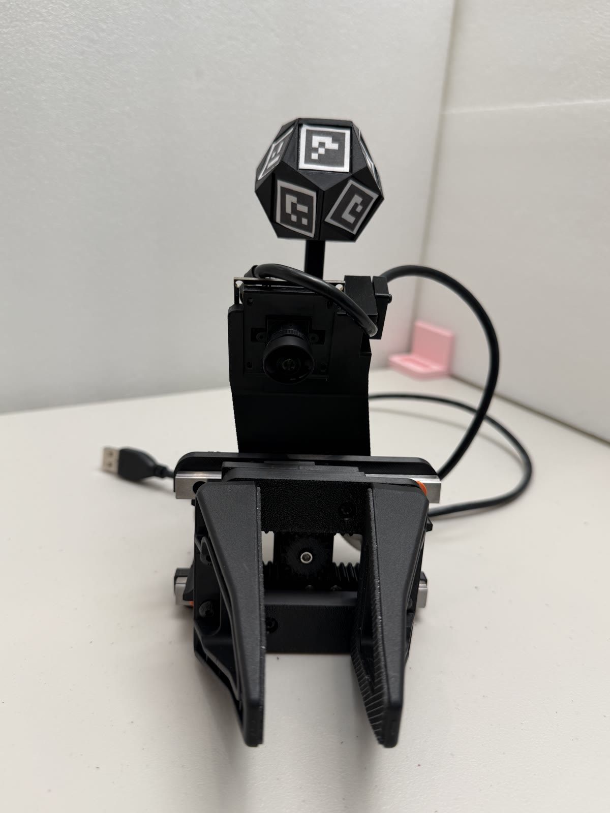

# Position tracking

**This is an optional add-on.** The default way to recover wrist pose with
YAM-UMI is camera SLAM from the wrist fisheye, the same approach the original UMI
used — it needs nothing from this directory and keeps collection portable.

What is here is a **dodecahedral ArUco marker ball** on a stalk, observed by an
external forward-facing camera, for setups that can accommodate a fixed camera.
It measures sub-millimetre on settled holds (numbers below), at the cost of
confining collection to that camera's view. Ball markers use the
**`DICT_4X4_100`** dictionary, IDs 25–49; IDs 0–24 are reserved for the
robot-mounted ball used to validate tracking against forward kinematics (see
[forward-cam-umi](https://github.com/YosubShin/forward-cam-umi)).

<p align="center">
  
</p>
<p align="center"><em>The assembled gripper with the dodecahedral tracker on its
stalk, held clear of the hand and of the fisheye camera's view.</em></p>

## Parts

| Part | Size (mm) | Notes |
|---|---|---|
| `dodeca_marker_ball_v2` | 51.05 across | Regular dodecahedron; carries the 15 mm markers |
| `stalk_rod_80mm` | 8 × 8 × 80 | Rod holding the ball clear of the hand |
| `wrist_stalk_arc_adapter` | 44 × 14 × 49.8 | Mounts the stalk to the wrist |
| `arc_extender` | 43.5 × 41.5 × 57 | Extends the arc mount |

A dodecahedron is used so that at least one face is well-conditioned for pose
estimation from any viewing direction, which removes the orientation blind spots
a single planar marker has.

## Markers

`glove_markers_v4.pdf`, group *dodecahedron ball*: **15 mm markers on 19.5 mm
tiles, IDs 25–35**, applied to eleven faces of the ball.

The left column of the sheet is all YAM-UMI needs: the *dodecahedron ball*
group and the *tips WRIST* group ([below](#aperture-markers)).

### Ignore the right column

The right-hand column — the *tails* (BACK, TOP, FORWARD, OUTSIDE, BOTTOM) and
*base* (BACK, TOP) groups, IDs 36–49 — is not used by YAM-UMI. Don't print or cut
those for this build.

They belong to [forward-cam-umi](https://github.com/YosubShin/forward-cam-umi), an attempt to remove the wrist camera and
make the glove entirely electronics-free. Without a wrist camera, the external
forward camera has to recover both wrist pose and gripper width by itself, and
that takes extra markers and printed parts: tails that ride on the gripper tips
and stay visible when the tips themselves are occluded, and a reference marker
holder on the back of the gripper to measure them against. Both projects share
this sheet so the marker IDs never collide.

> **Print at 100% scale.** In the print dialog, choose *Actual size* and disable
> *Fit to page*, *Shrink oversized pages*, and any scaling. A sheet printed at
> 97% produces pose estimates that look plausible and are wrong by 3% in range —
> a failure that will not announce itself.

After printing, check the 100 mm bar with calipers before cutting anything out,
then measure one marker's black square in each group you use and record that
value in the config. This takes a minute and is the only check that catches a
mis-scaled print. As the sheet notes, use matte paper for markers on faces that
point up or down.

Apply markers with double-sided tape across the **entire** face, not just the
edges, so they cannot curl or lift. A marker that bows near an edge biases the
corner detection that pose estimation depends on.

### Marker placement is not prescribed

There is deliberately **no face-to-ID mapping to follow**. Apply the eleven
markers to the faces in any arrangement, then recover the layout by
running the assembled ball through a solver that estimates each marker's pose in
the ball's body frame from observations across many viewpoints.

This is worth understanding before you build: the ball's geometry is calibrated,
not assumed. It means print-and-stick tolerances are absorbed by the calibration
rather than becoming permanent error, and it means **your ball's mapping will
differ from anyone else's** — the calibration output is specific to the physical
unit you built and has to travel with it.

<!-- TODO: point at the solver. Right now a reader has the hardware and the
     marker sheet but no way to get from "ball with stickers on it" to a usable
     pose stream. Either link the tool you used, name the off-the-shelf
     equivalent, or write down the procedure and the output format. This is the
     single biggest gap for anyone trying to reproduce the tracking. -->

### Measured performance

All figures below were taken with the ball at roughly 94 cm standoff from the
external camera, **on settled holds**.

**Precision**

| Metric | Result |
|---|---|
| Within-hold | 0.46 mm RMS (median), p90 0.68 mm |
| Revisit repeatability | 0.08–0.17 mm SD per axis (lateral 0.12, depth 0.17) |

**Coverage** — the fraction of frames with enough faces visible to solve a bundle
pose. This is where the choice of external camera shows up:

| Camera | ≥1 face | ≥2 faces | ≥3 faces |
|---|---|---|---|
| Sony (4K 30p, H.264) | 100% | 90.8% | 77.5% |
| Arducam B0591 (1080p, focus locked via v4l2) | 79.6% | 68.3% | 59.1% |

The B0591 numbers were measured before any mount or field-of-view tuning for
that camera. The 15 mm faces give it comfortable pixels at this range, so the
gap to the Sony is a field-of-view and mounting difference rather than a
sensor limit — treat 68% as a floor, not a verdict on cheaper webcams.

#### The camera that ended up winning: Arducam B0587 (4K low-light)

After the table above we moved to the **Arducam B0587** (4K STARVIS2 sensor,
~88° FOV, UVC/MJPEG) and it became the workhorse — it is the camera behind
every number in [`dynamic-accuracy.md`](dynamic-accuracy.md):

| Metric | Result |
|---|---|
| ChArUco intrinsics | 0.744 px RMS at 4K |
| Rigid marker-pair RMS (best pairs) | 0.7 mm |
| Detection vs arm speed | flat to 3 m/s — no measured ceiling |
| Per-frame ≥1-face detection, full teleop session | 99.97% |

**Why it works — the motion-blur unlock.** Fiducial tracking during motion
dies by corner smear, not by frame rate: at 25 fps a marker moving 1 m/s
travels 40 mm between frames, but what kills the *decode* is how far it moves
during the *exposure*. The recipe is a very fast shutter on a sensor that can
afford it:

- **Exposure 0.2 ms** (`exposure_time_absolute=2`, manual mode, gain 0,
  sharpness 0). At 0.2 ms, even 3 m/s of motion smears only 0.6 mm —
  sub-pixel at ~1 m standoff — so the corner detector simply never sees
  blur, and the speed ceiling disappears.
- **A low-light sensor makes that exposure usable.** 0.2 ms under ordinary
  indoor lighting starves a typical webcam sensor; the STARVIS2's
  sensitivity yields clean, zero-gain images at that shutter in a bright
  lab. This pairing — fast shutter *enabled by* low-light silicon — is the
  whole trick, and it is worth selecting cameras for explicitly. (In dim,
  ceiling-light-only conditions the same camera certified at 1 ms +
  gain 20 with equivalent tracking quality.)

Hard-won caveats that travel with this camera class:

1. **Control readback lies.** UVC exposure writes are accepted and read
   back correctly *whether or not the imaging pipeline latched them* — and
   on some modules they only latch after streaming has started. Apply the
   settings mid-stream and verify **behaviourally**: wave a hand in front
   of the lens; at 0.2 ms it must be frozen, not smeared. We lost a full
   session to trusting readback before learning this.
2. **Image brightness is not an exposure probe** on HDR/tone-mapping ISPs —
   some modules normalise brightness toward a target regardless of the real
   exposure. Streaks and blur are the probe; brightness is not.
3. **Some modules' `focus_absolute` is accepted but inert** (the B0587
   focuses by physically rotating the barrel only). Verify focus with a
   live sharpness meter, then mechanically lock the barrel with a witness
   mark — and recalibrate intrinsics after *any* barrel movement.
4. **Flickering LED lighting strobes at sub-millisecond shutters.** Room
   light that looks steady to the eye can beat against a 0.2 ms exposure;
   use DC or high-frequency-driven lighting for the capture volume.

#### Locking focus on the external camera

**Lock the external camera's focus before collecting anything.** The Arducam is
an autofocus module, and autofocus is actively harmful here: refocusing changes
the effective focal length, which shifts the pose solution under a camera the
calibration assumes is fixed. The result is drift that looks like tracking noise
and is not.

There is no hardware switch — set it through V4L2 on Linux. Control names differ
across kernel and driver versions, so list them first:

```
v4l2-ctl -d /dev/video0 --list-ctrls
```

Then disable autofocus and pin a focus value, using whichever names appeared
(`focus_automatic_continuous` on newer uvcvideo, `focus_auto` on older):

```
v4l2-ctl -d /dev/video0 --set-ctrl=focus_automatic_continuous=0
v4l2-ctl -d /dev/video0 --set-ctrl=focus_absolute=<value>
```

Pick the value by focusing on the ball at your working standoff, reading back
`focus_absolute`, then setting it explicitly. These controls reset when the device
is replugged, so reapply them at the start of every session — or with a udev rule
— and re-run the camera calibration if the focus value ever changes.

#### What these numbers do and do not support

1. **Settled holds only** — *resolved 2026-09*: dynamic tracking has since
   been certified on the real arm at full manipulation speed; see
   [`dynamic-accuracy.md`](dynamic-accuracy.md). The 0.46 mm figure remains
   the settled-hold precision, consistent with the 0.7 mm rigid-pair RMS
   measured there.
2. **Relative, not absolute** — *resolved 2026-09*: the 14% scale / 9°
   direction discrepancies were extrinsics error, fixed by a proper
   robot-world hand-eye calibration; absolute robot-frame pose now agrees
   with forward kinematics to 7.7 mm median / 22.7 mm p95, with the
   hand-eye residual (4.8 mm) as the floor. Details and method in
   [`dynamic-accuracy.md`](dynamic-accuracy.md).

<!-- TODO: publish the calibration procedure itself — how the bundle solve is run
     and what it outputs — so someone else can reproduce these numbers rather than
     just read them. -->

## Aperture markers

Gripper aperture is read from AprilTag markers on the gripper tips, seen by the
wrist fisheye camera. Because the wrist camera sees both tips in every frame, the
gripper width can be solved at any moment and recorded alongside the video, so the
training dataset carries the gripper width for every frame.

`glove_markers_v4.pdf`, group *tips WRIST*: **6 mm AprilTag 16h5 markers on
8 mm tiles, IDs 2 (A) and 3 (B)**, one per tip. They use a separate AprilTag
family so they don't take IDs from the ArUco range. The markers have to stay
resolvable in the fisheye view, where the tips sit well off-axis and the
effective resolution is much lower than the sensor's nominal figure suggests.

The same 100% scale rule and full-face taping apply as for the ball markers
above.

Each marker sits **25 mm from the gripper base** — as far from the fisheye camera
as the tip's flat area allows. The camera looks down at an angle, so distance from
it moves the marker toward the centre of the frame and away from the distorted
edge; the limit is mechanical, not optical, since the tip narrows and eventually
offers no flat patch wide enough to seat a marker. See
[assembly](../docs/assembly.md#4-aperture-markers).
